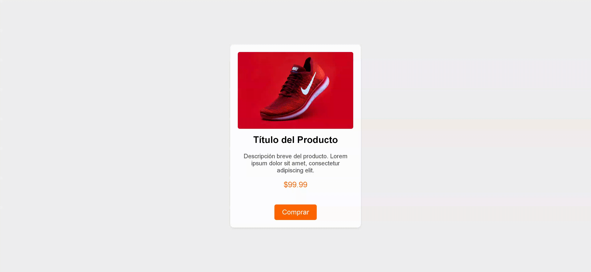
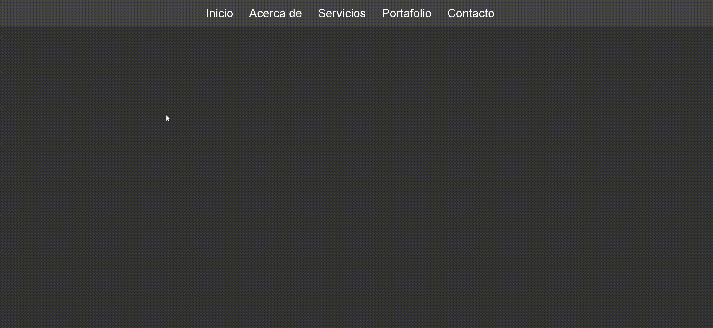
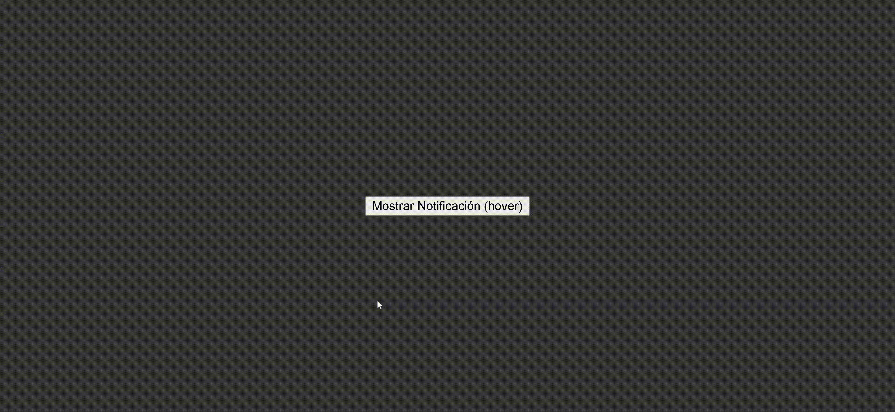
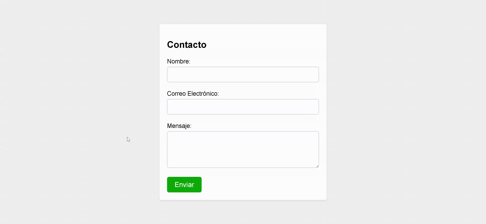
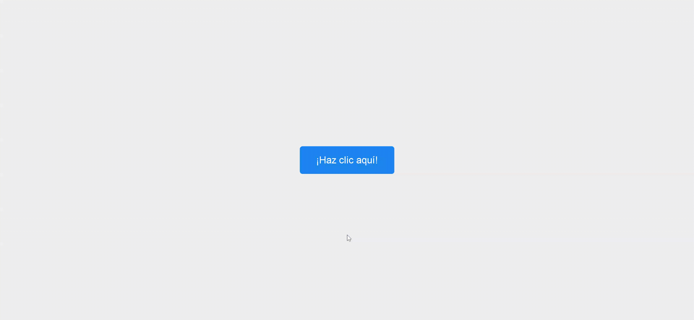
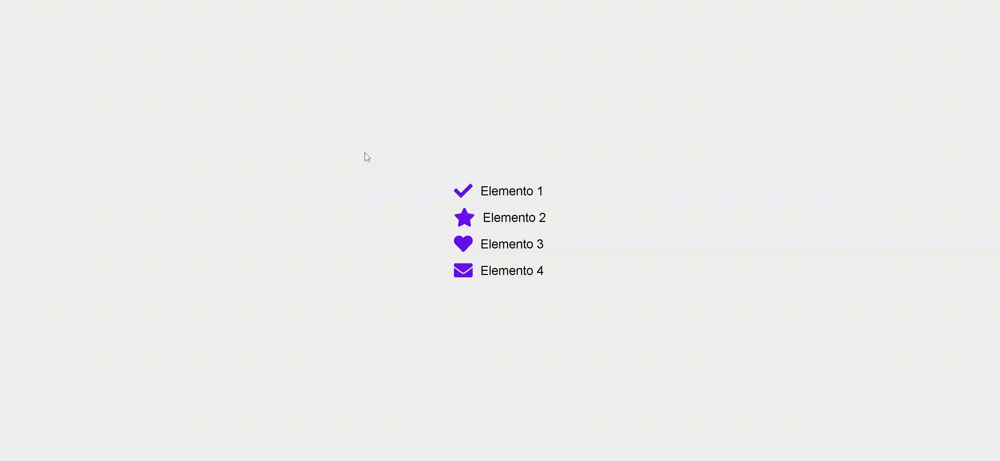
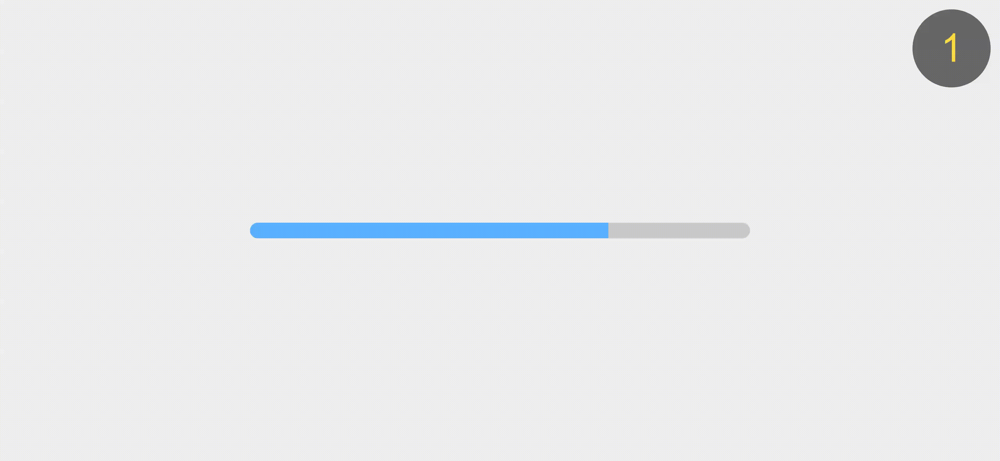

# Ejercicios de replica

## Ejercicio 1 | product-card

### Colores:

-  `#fff`
-  `#f0f0f0`
-  `#0000001a`
-  `#555`
-  `#ff6600`
-  `#e64900`

## Ejercicio 2 | horizontal-navbar

### Colores:

-  `#333`
-  `#444`
-  `#fff`
-  `#3c59fa`

## Ejercicio 3 | popup-box

### Colores:

-  `#333`
-  `#fff`
-  `#00000033`

## Ejercicio 4 | contact-form

### Colores:

-  `#f0f0f0`
-  `#fff`
-  `#0000001a`
-  `#ccc`
-  `#0eac08`
-  `#079444`

## Ejercicio 5 | modern-button

### Colores:

-  `#f0f0f0`
-  `#fff`
-  `#1d87f1`
-  `#003eb1`

## Ejercicio 6 | icons-list

### Colores:

-  `#f0f0f0`
-  `#6a0fe8`
-  `#a575ff`

## Ejercicio 7 | animated-progressbar

### Colores:

-  `#f0f0f0`
-  `#ccc`
-  `#5cb3fe`
